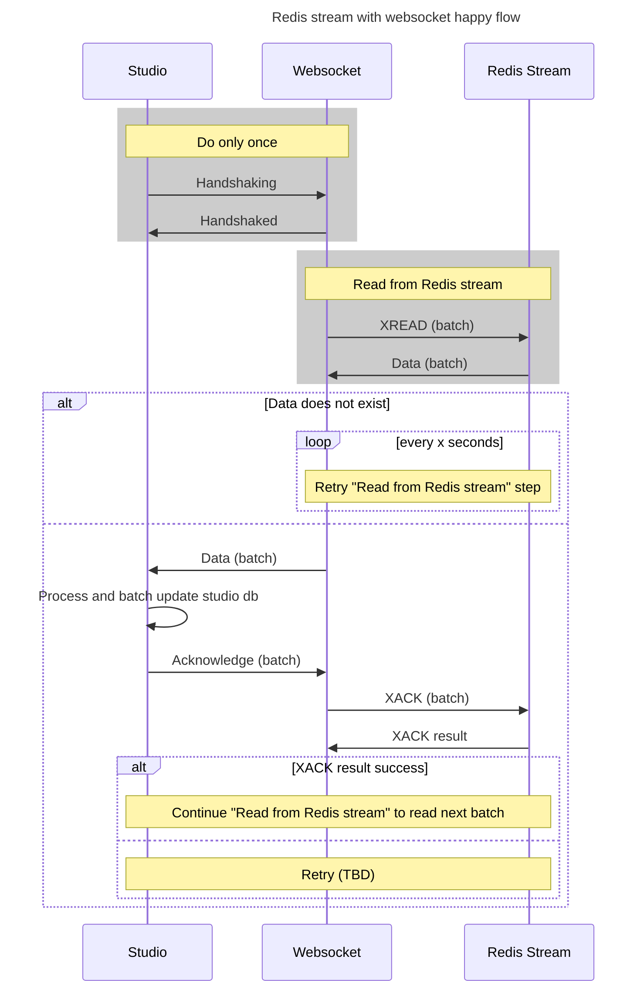

```mermaid
sequenceDiagram
  title: Redis stream with websocket happy flow

  participant S as Studio
  participant W as Websocket
  Participant R as Redis Stream

  rect rgba(0, 0, 0, 0.2)
    Note over S,W: Do only once
    S->>W: Handshaking
    W->>S: Handshaked
  end

  rect rgba(0, 0, 0, 0.2)
    Note over W,R: Read from Redis stream
    W->>R: XREAD (batch)
    R->>W: Data (batch)
  end

  alt Data does not exist
    loop every x seconds
      Note over W,R: Retry "Read from Redis stream" step
    end
  else
    W->>S: Data (batch)
    S->>S: Process and batch update studio db
    S->>W: Acknowledge (batch)
    W->>R: XACK (batch)
    R->>W: XACK result

    alt XACK result success
      Note over S,R: Continue "Read from Redis stream" to read next batch
    else
      Note over S,R: Retry (TBD)
    end
  end
```