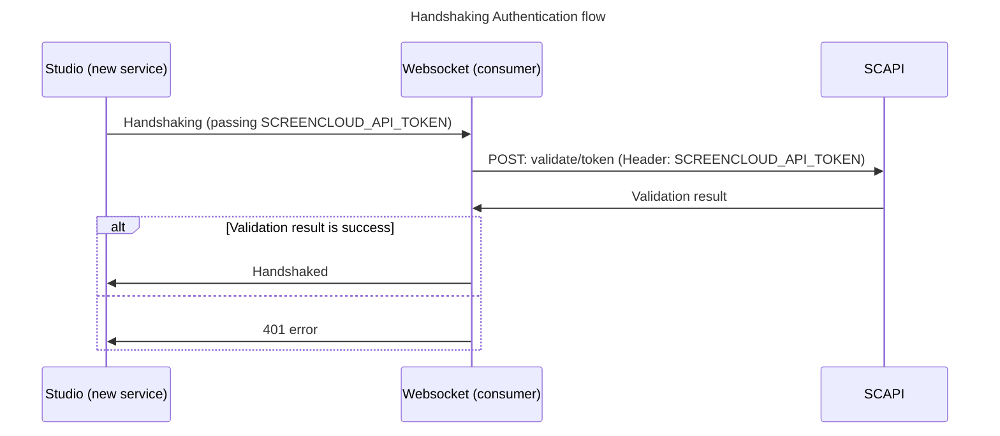

```mermaid
sequenceDiagram
  title: Handshaking Authentication flow

  participant S as Studio (new service)
  participant W as Websocket (consumer)
  Participant SC as SCAPI

  S->>W: Handshaking (passing SCREENCLOUD_API_TOKEN)
  W->>SC: POST: validate/token (Header: SCREENCLOUD_API_TOKEN)
  SC->>W: Validation result
  alt Validation result is success
    W->>S: Handshaked
  else
    W->>S: 401 error
  end
```